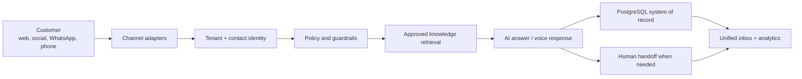

# AI Omnichannel Platform Readiness Report

Date: 2026-06-29

## Executive Answer

No single platform is "perfect" today for every business that wants one database, all customer channels, and AI answers by text and voice. The market is strong enough to build this now, but the best result is usually a controlled platform architecture rather than a fully outsourced all-in-one tool.

For Assaddar, the current repository is already pointed in the right direction. It has the core shape of a real omnichannel AI communication platform:

- one tenant-scoped PostgreSQL database
- approved business knowledge
- website chat
- WhatsApp, Instagram, Messenger, TikTok, and telephone adapter boundaries
- unified contacts and conversations
- inbox, handoff, usage, audit, and compliance foundations
- AI answer guardrails that only answer from approved tenant knowledge
- a provider-neutral voice bridge

The platform should not yet be called production-perfect. It is a strong MVP/foundation. To sell it confidently for business-critical text and phone use, it still needs hardened provider integrations, production voice streaming, credential encryption, sending-window enforcement, retries, monitoring, evaluation, and human handoff operations.

## Target Platform Definition

The target product is a business-controlled AI communication layer:

1. A business stores its approved information once.
2. Customers contact the business through website chat, WhatsApp, Instagram, Messenger, TikTok, email, or phone.
3. The AI identifies the tenant, customer, channel, and conversation context.
4. The AI answers only from approved business data.
5. The platform escalates uncertain, risky, or operational requests to a human.
6. The business sees one customer profile and one conversation timeline across all channels.
7. Text and voice interactions share the same knowledge, policies, analytics, and audit trail.

This is achievable with current technology.

## Current Repository Assessment

### What Is Already Strong

The repository has the correct product boundary: runtime tenant data, channel credentials, answer policy, logs, and dashboards live in the platform, not in a marketing website.

The database model already supports the key objects needed for an omnichannel product, including:

- tenants
- users, roles, memberships, sessions, and invites
- channel connections and webhook events
- contacts
- knowledge sources, documents, and chunks
- allowed intents and blocked topics
- conversations, messages, calls, and call transcripts
- handoff requests
- answer feedback
- message deliveries
- WhatsApp templates
- audit logs and usage events

The answer engine is intentionally conservative. It does not behave like an unrestricted chatbot. It retrieves tenant-scoped approved knowledge, checks confidence, blocks unsafe or off-topic topics, and recommends refusal or handoff when it cannot safely answer.

The channel architecture is also correct. Channel adapters keep website, Meta channels, TikTok, WhatsApp, and telephone separated from the core engine. That matters because every channel has different identity, sending, compliance, template, and webhook rules.

### What Is Not Yet Production-Perfect

The main gaps are not conceptual. They are operational:

- Real provider credentials and production send paths still need to be completed.
- Channel tokens now have an app-managed AES-256-GCM encryption interface backed
  by `CHANNEL_CREDENTIAL_MASTER_KEY`; true KMS/envelope encryption and rotation
  remain production upgrades.
- WhatsApp, Messenger, and Instagram automated replies now have hard 24-hour
  freeform reply-window checks; template-only outbound flows still need to be
  completed.
- Meta webhook idempotency is now implemented where provider message IDs are
  present; each future provider should expose and persist its stable event ID.
- Worker jobs have bounded retry/dead-letter defaults; outbound delivery still
  needs full queued retry/replay operator controls.
- Voice needs a production SIP/RTP or telephony media edge, not only a turn-based bridge.
- Human handoff summaries, callback flows, and agent routing need to be finished.
- Evaluation tooling is needed to test answer quality against tenant knowledge before each release.
- Production observability needs channel-specific health, latency, cost, and failure dashboards.
- Retention cleanup and verified data-subject workflows are still needed for GDPR-grade operation.

## Market Landscape

There are three realistic platform strategies.

### Option A: Buy A Large CRM/Service Platform

Examples: Salesforce Agentforce, Zendesk AI, Intercom Fin, Microsoft Copilot Studio, Google Dialogflow CX / Conversational Agents.

Best for:

- companies already standardized on one ecosystem
- teams that want low-code configuration
- fast internal deployment
- broad support operations

Tradeoffs:

- higher platform cost
- less control over data model and product differentiation
- harder to package as Assaddar's own SaaS
- voice and social channels may still require connectors or add-ons
- business knowledge and customer data often become tied to the vendor's ecosystem

### Option B: Use CPaaS/Contact-Center Providers Plus Own AI Layer

Examples: Twilio for voice/SMS, Meta WhatsApp Cloud API for WhatsApp, provider webhooks for Messenger/Instagram, SIP providers for telephone, OpenAI Realtime/API for AI voice and text logic.

Best for:

- owning the customer database
- building a differentiated SaaS
- EU/GDPR-aware deployment choices
- custom business workflows
- channel flexibility

Tradeoffs:

- more engineering responsibility
- more compliance and provider-rule work
- more monitoring, retries, and support tooling required
- voice quality depends heavily on the telephony edge

### Option C: Hybrid

Use the Assaddar platform as the system of record and AI policy layer, while integrating selected third-party systems for CRM, ticketing, telephony, or helpdesk use.

This is the recommended path. It keeps Assaddar's strategic asset, the unified tenant database and AI answer engine, while allowing customers to connect existing tools where needed.

## Recommended Architecture

Core principle: channels are replaceable; the business database, policies, knowledge, audit trail, and customer timeline are not.

## Recommended Technology Direction

Keep PostgreSQL as the primary system of record. Use `pgvector` or an equivalent vector store for semantic retrieval, but keep business objects relational.

Use the existing answer engine as the control layer. Add LLM generation only after retrieval and policy checks, and pass only the tenant context needed for the answer.

Use OpenAI or another model provider behind an interface. For text, use retrieval-grounded responses. For phone, use a production real-time audio stack when low-latency speech-to-speech is required, or keep a speech-to-text / answer / text-to-speech pipeline for simpler deployments.

Use channel-specific providers rather than forcing all channels through one vendor:

- Website: owned widget and API
- WhatsApp: Meta WhatsApp Cloud API or approved BSP
- Instagram/Messenger: Meta webhooks and messaging APIs
- Telephone: SIP trunk or Twilio/telephony provider plus voice edge
- CRM/helpdesk: optional connectors, not the system of record by default

## Build vs Buy Decision

For Assaddar, build the core platform and integrate providers.

Reason:

- The business value is the unified customer database, tenant-specific knowledge, channel abstraction, GDPR-aware controls, and AI policy layer.
- Buying a full platform would reduce engineering work but would also make Assaddar less differentiated.
- The existing repo already contains much of the hard architectural foundation.

Do not try to build every commodity layer from scratch. Use mature providers for telephony transport, WhatsApp delivery, authentication hardening, observability, email delivery, and model inference where appropriate.

## Production Readiness Roadmap

### Phase 1: Production Safety

- Replace the env-key credential cipher with KMS/envelope encryption and add key
  rotation procedures.
- Complete template-only outbound flows for messages outside the Meta 24-hour
  freeform window.
- Extend provider event ID idempotency to every future channel provider.
- Add operator replay controls for retry/dead-letter outbound delivery.
- Add scheduled retention cleanup.
- Add audit coverage for sensitive tenant and channel settings.

### Phase 2: Real Channels

- Complete WhatsApp Cloud API sending and template status sync.
- Complete Messenger/Instagram outgoing sends with page/account mapping.
- Replace TikTok mock with real partner/API integration when access is available.
- Add email if business demand requires it.
- Build integration health dashboards per channel.

### Phase 3: Production Voice

- Deploy a SIP/RTP or telephony media edge.
- Add real-time transcription, interruption handling, latency monitoring, call recording policy, and transfer flows.
- Add call summaries, callback tasks, and human handoff routing.
- Add voice-specific evaluation: latency, transcription accuracy, answer correctness, fallback rate, and transfer success.

### Phase 4: AI Quality And Operations

- Add an evaluation set per tenant.
- Add regression tests for approved knowledge answers and refusal behavior.
- Add operator review queues for low-confidence answers and failed handoffs.
- Add answer feedback loops without training shared models on customer data.
- Add cost controls by tenant, channel, and model.

### Phase 5: Commercial SaaS Hardening

- Add billing enforcement, plan limits, and overage handling.
- Add tenant onboarding workflows.
- Add role-based access polish and customer self-service setup.
- Add backup, restore, incident response, and status reporting.
- Add connector marketplace positioning for CRM/helpdesk integrations.

## Risk Register

| Risk                               | Impact | Mitigation                                                             |
| ---------------------------------- | ------ | ---------------------------------------------------------------------- |
| AI answers from unapproved data    | High   | Keep retrieval-grounded answering and refusals as default              |
| Channel rule violations            | High   | Hard-block sends outside allowed windows and template rules            |
| Voice latency or poor call quality | High   | Use production media edge, monitor latency, support transfer           |
| Provider webhook duplicates        | Medium | Store event IDs and make processing idempotent                         |
| Credential leakage                 | High   | Encrypt tokens with KMS, rotate secrets, redact logs                   |
| Tenant data leakage                | High   | Keep tenant-scoped repository methods and enforce RLS defense in depth |
| Cost spikes                        | Medium | Per-tenant rate limits, usage events, model routing, alerts            |
| Vendor lock-in                     | Medium | Keep provider adapters and own the database                            |

## Verdict

Assaddar does not yet have a perfect production platform, but it has the correct foundation for one. The best path is not to replace it with a single external tool. The best path is to harden this platform into the controlled system of record for business conversations, while using external providers for delivery channels, telephony, and model inference.

In practical terms:

- Yes, the architecture can support one database for multiple business channels.
- Yes, current AI technology can answer by text and voice from the same business knowledge.
- No, the current implementation should not yet be sold as fully production-ready for all channels.
- The next milestone should be a production-safe omnichannel beta: website chat + WhatsApp + telephone voice, backed by one tenant database, unified inbox, approved knowledge, hard guardrails, and human handoff.

## Sources

Internal repository sources:

- `README.md`
- `docs/architecture.md`
- `docs/integrations.md`
- `docs/security-gdpr.md`
- `docs/supabase.md`
- `packages/db/src/schema.ts`

External official sources reviewed:

- OpenAI Realtime and audio documentation: https://platform.openai.com/docs/guides/realtime
- Twilio Programmable Voice documentation: https://www.twilio.com/docs/voice
- Meta WhatsApp Cloud API documentation: https://developers.facebook.com/docs/whatsapp/cloud-api
- Salesforce Agentforce product page: https://www.salesforce.com/agentforce/
- Microsoft Copilot Studio overview: https://learn.microsoft.com/en-us/microsoft-copilot-studio/fundamentals-what-is-copilot-studio
- Google Dialogflow CX documentation: https://cloud.google.com/dialogflow/cx/docs
- Intercom/Fin product page: https://www.intercom.com/fin
