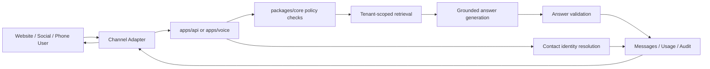

# Architecture

## Product Boundary

This repository is the product platform. Marketing sites should connect to it through public APIs or the embeddable widget, but they should not own runtime tenant data, channel credentials, answer policy, usage logs, or conversations.

## Runtime Flow

## Applications

- `apps/api`: Fastify API for admin, public widget endpoints, message handling, webhook verification, contact identity, unified inbox, WhatsApp template/compliance operations, usage logging, and API documentation.
- `apps/admin`: Next.js dashboard for internal admin and customer self-service. It covers tenant setup, daily operations, lead follow-up, unified inbox, contact profiles, FAQ management, assistant testing, widget embed access, channel setup, and WhatsApp operations.
- `apps/widget`: Shadow DOM isolated website chatbot script with public config loading, conversation continuity, theming, and client-side message throttling.
- `apps/workers`: BullMQ worker foundation for file parsing, embeddings, webhook processing, retries, summaries, and usage metering.
- `apps/voice`: telephone voice runtime with a provider-neutral `/voice/turn` bridge for SIP/RTP edges plus a legacy Twilio TwiML route.

## Packages

- `packages/core`: Channel-independent answer engine, tenant policy enforcement, intent classification, retrieval ranking, refusal/handoff behavior, and trace output.
- `packages/db`: Drizzle schema, Postgres migration SQL, tenant-scope helpers, repository methods, seed data, audit logging, export/delete helpers.
- `packages/channels`: Adapter interfaces and provider skeletons for Website, WhatsApp, Instagram, Messenger, TikTok, and Telephone.

## Tenant Isolation

Every tenant-scoped table has `tenant_id`. Repository methods require a tenant ID before reading or mutating tenant data. Migration SQL enables PostgreSQL row-level security policies based on `app.current_tenant_id`; production database roles should be configured so application roles cannot bypass RLS.

## Omnichannel Identity

Customer identity is represented by tenant-scoped contact profiles. Conversations can link to a contact, and the repository can merge signals from website visitor IDs, WhatsApp numbers, Messenger/Instagram sender IDs, telephone caller IDs, lead form fields, email addresses, phone numbers, and company names. This gives the admin UI one customer timeline instead of separate anonymous channel records.

## WhatsApp Operations

WhatsApp templates are stored per tenant with language, category, status, variables, and provider template ID. Delivery attempts are recorded separately from messages so provider failures, skipped sends, and future retries can be inspected without losing the conversational transcript. The compliance view reports whether the latest WhatsApp conversation is inside the 24-hour response window or needs a template.

Tenant data can later move to a dedicated database because:

- tenant-owned records already include `tenant_id`
- public assistant IDs are separate from internal tenant IDs
- channel adapters are stateless and repository-backed
- answer engine dependencies are abstract interfaces

## Answer Engine Guardrails

The engine answers only when all checks pass:

1. Message is normalized and under the tenant length limit.
2. Message does not match blocked topics.
3. Intent is enabled for the tenant.
4. Tenant-scoped approved knowledge is retrieved.
5. Retrieval confidence is above threshold.
6. The response is extracted from the approved chunk.

Failures return a refusal or handoff recommendation. The MVP intentionally avoids a general-purpose assistant mode.

## Provider Abstraction

Supabase Postgres is used through `DATABASE_URL`; the data layer remains portable to any PostgreSQL-compatible host with `pgvector`. OpenAI, Meta, TikTok, Twilio, object storage, and encryption providers are behind environment variables or adapter interfaces. The local MVP can run without those external credentials.

## OneBrain Boundary

The communication platform can integrate with `onebrain` as an external memory
and knowledge service, but it remains the runtime owner for channels,
conversations, contacts, handoffs, delivery state, billing, and operator
workflows. OneBrain should own durable cross-app knowledge, intake records,
privacy-aware memory, access policy, and long-term retrieval.

The first integration path is background-only:

- `packages/core` exposes a typed OneBrain service client and `BrainProvider`
  contract.
- `apps/workers` can run an opt-in `onebrain.sync` BullMQ job.
- The sync job exports approved local knowledge chunks through
  `POST /api/service/intake` with `app_id=communication`.
- `onebrain_sync_records` stores per-tenant source refs and content hashes so
  unchanged records are not sent repeatedly.
- Live widget/social/voice answers still use the local Project Brain and answer
  engine unless a tenant is explicitly moved to a remote answer provider later.

This keeps the service boundary API-based. The repositories do not share
database schemas or vector tables.
