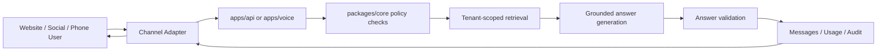

# Architecture

## Product Boundary

This repository is the product platform. Marketing sites should connect to it through public APIs or the embeddable widget, but they should not own runtime tenant data, channel credentials, answer policy, usage logs, or conversations.

## Runtime Flow

## Applications

- `apps/api`: Fastify API for admin, public widget endpoints, message handling, webhook verification, usage logging, and API documentation.
- `apps/admin`: Next.js dashboard for internal admin and customer self-service. The MVP covers tenant creation, FAQ management, assistant testing, and widget embed access.
- `apps/widget`: Shadow DOM isolated website chatbot script with public config loading, conversation continuity, theming, and client-side message throttling.
- `apps/workers`: BullMQ worker foundation for file parsing, embeddings, webhook processing, retries, summaries, and usage metering.
- `apps/voice`: Twilio-first voice webhook runtime using speech input, the shared answer engine, and TwiML responses.

## Packages

- `packages/core`: Channel-independent answer engine, tenant policy enforcement, intent classification, retrieval ranking, refusal/handoff behavior, and trace output.
- `packages/db`: Drizzle schema, Supabase/Postgres migration SQL, tenant-scope helpers, repository methods, seed data, audit logging, export/delete helpers.
- `packages/channels`: Adapter interfaces and provider skeletons for Website, WhatsApp, Instagram, Messenger, TikTok, and Telephone.

## Tenant Isolation

Every tenant-scoped table has `tenant_id`. Repository methods require a tenant ID before reading or mutating tenant data. Migration SQL enables PostgreSQL row-level security policies based on `app.current_tenant_id`; production database roles should be configured so application roles cannot bypass RLS.

Tenant data can later move to a dedicated database because:

- tenant-owned records already include `tenant_id`
- public assistant IDs are separate from internal tenant IDs
- channel adapters are stateless and repository-backed
- answer engine dependencies are abstract interfaces

## Answer Engine Guardrails

The engine answers only when all checks pass:

1. Message is normalized and under the tenant length limit.
2. Message does not match blocked topics.
3. Intent is enabled for the tenant.
4. Tenant-scoped approved knowledge is retrieved.
5. Retrieval confidence is above threshold.
6. The response is extracted from the approved chunk.

Failures return a refusal or handoff recommendation. The MVP intentionally avoids a general-purpose assistant mode.

## Provider Abstraction

Supabase is used as managed Postgres through `DATABASE_URL`; the data layer remains portable to any PostgreSQL-compatible host with `pgvector`. OpenAI, Meta, TikTok, Twilio, object storage, and encryption providers are behind environment variables or adapter interfaces. The local MVP can run without those external credentials.
