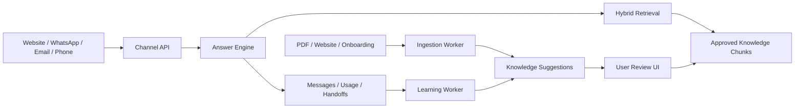

# Project Brain, Learning Queue, and Document Ingestion Design

Date: 2026-07-03

## Summary

Build a tenant-scoped Project Brain that feeds every customer channel from the
same approved business knowledge, while learning from real interactions through
user-approved suggestions.

The Brain is not a model that retrains itself after every conversation. It is a
controlled knowledge system:

- structured onboarding answers and business facts
- uploaded documents and crawled website text
- approved FAQ and policy chunks
- hybrid keyword plus semantic retrieval
- a learning queue that proposes new or improved knowledge
- user approval before any learned content becomes active

This keeps answers efficient, auditable, and safe. PDFs and other files are read
once during ingestion, split into chunks, embedded, and stored. At answer time,
the engine retrieves only the most relevant chunks instead of sending whole
files to the model or prompt.

## Current State

The repository already has the foundation for this design:

- `knowledge_sources`, `knowledge_documents`, and `knowledge_chunks` model
  tenant-scoped knowledge.
- `knowledge_chunks.embedding vector(1536)` and the HNSW index support semantic
  retrieval.
- Full-text search indexes support keyword retrieval.
- `apps/workers` already has embedding jobs and a periodic missing-embedding
  backfill.
- `packages/core` has a conservative answer engine that retrieves approved
  tenant knowledge, checks confidence, and refuses or hands off when knowledge
  is missing.
- Conversations, messages, handoff requests, usage events, and answer feedback
  are already stored per tenant.
- The admin dashboard already exposes tenant setup, inbox, FAQ management, and
  assistant testing surfaces.

The missing pieces are:

- a first-class onboarding questionnaire that seeds useful Brain content
- document upload and parsing for PDFs and similar company files
- a reviewable learning queue for suggestions from conversations and human
  replies
- conflict and duplicate detection before suggestions are approved
- UI controls for approving, editing, rejecting, and merging suggestions
- consistent freshness/status metadata around generated and uploaded knowledge

## Goals

- Give each tenant one Project Brain used by website chat, WhatsApp, Instagram,
  Messenger, TikTok, Telegram, email, and telephone.
- Let new users answer a standard onboarding questionnaire so the assistant has
  useful knowledge immediately.
- Allow users to upload PDFs and business documents without paying runtime token
  costs for reading entire files repeatedly.
- Extract, chunk, embed, and store uploaded content once.
- Learn from customer interactions by proposing new or improved knowledge.
- Require user approval before learned content becomes active.
- Keep the answer engine grounded in `approved` knowledge only.
- Surface unanswered questions, low-confidence outcomes, and human replies as
  actionable suggestions.
- Keep tenant isolation, auditability, and GDPR retention boundaries intact.

## Non-Goals

- Do not fine-tune a separate model per tenant in V1.
- Do not let customer messages automatically update active knowledge.
- Do not send whole uploaded files to the answer prompt at runtime.
- Do not build a general data lake or analytics warehouse.
- Do not replace existing FAQ knowledge management; extend it.
- Do not support complex multi-step approval workflows beyond owner/admin review
  in V1.
- Do not make draft or pending suggestions retrievable by customer-facing
  channels.

## Chosen Approach

Use retrieval-augmented generation and deterministic approval controls.

The Brain has two zones:

1. **Active knowledge**
   - approved chunks from FAQs, onboarding answers, document ingestion, and
     user-approved suggestions
   - available to all channel answer flows
   - indexed by full-text search and embeddings

2. **Learning queue**
   - pending suggestions generated from unanswered questions, human replies,
     document extraction, duplicate detection, and feedback
   - visible in the admin UI
   - never used for customer-facing answers until approved

When a suggestion is approved, the platform creates or updates the underlying
knowledge source/document/chunk records, queues embedding generation, and writes
an audit log.

## Architecture

## Data Model

### Existing Tables To Reuse

`knowledge_sources`

- One source per FAQ set, onboarding set, uploaded document set, crawled website,
  or learning-approved set.
- `type` examples: `faq`, `onboarding`, `document_upload`, `website`,
  `learned_suggestion`.

`knowledge_documents`

- One document per FAQ entry, uploaded file, web page, or approved suggestion
  batch.
- Store extracted/plain text in `content`.
- Use `checksum` to avoid re-ingesting identical uploads.
- Use `metadata` for file name, content type, source URL, page count, parser
  details, and version.

`knowledge_chunks`

- The retrievable units.
- Only `status = 'approved'` chunks are answerable.
- `embedding` is filled by the existing embedding worker/backfill.
- `metadata` should include extraction page/section, source confidence, and
  approval source.

### New Table: `brain_onboarding_answers`

Stores structured answers from the standard project questionnaire.

Fields:

- `id`
- `tenant_id`
- `question_key`
- `question`
- `answer`
- `category`
- `status`: `draft`, `approved`, `archived`
- `metadata`
- timestamps

Approved onboarding answers also create or update knowledge chunks, but keeping
the structured answer table makes it easy to edit business facts later.

### New Table: `knowledge_suggestions`

Stores all reviewable Brain learning proposals.

Fields:

- `id`
- `tenant_id`
- `source_type`: `unanswered_question`, `human_reply`, `document_extraction`,
  `feedback`, `manual`, `conflict_detection`
- `source_conversation_id`
- `source_message_id`
- `source_document_id`
- `suggested_question`
- `suggested_answer`
- `suggested_title`
- `suggested_tags`
- `suggested_metadata`
- `confidence`
- `status`: `pending`, `approved`, `rejected`, `merged`, `archived`
- `reviewed_by_user_id`
- `reviewed_at`
- `review_note`
- `approved_chunk_id`
- timestamps

Indexes:

- `(tenant_id, status, created_at desc)`
- `(tenant_id, source_type, created_at desc)`
- optional similarity support later for duplicate detection

### New Table: `document_ingestion_jobs`

Tracks upload/crawl processing and parser failures.

Fields:

- `id`
- `tenant_id`
- `source_id`
- `document_id`
- `object_key`
- `file_name`
- `content_type`
- `checksum`
- `status`: `queued`, `processing`, `pending_review`, `approved`,
  `failed`, `archived`
- `error`
- `parser_metadata`
- timestamps

This can initially be implemented as a database table plus BullMQ job payloads.
If object storage is not ready, local/dev uploads can still be represented with
metadata and extracted text.

## Standard Onboarding Questions

V1 should seed about 20 practical questions. The exact UI labels can be refined,
but the stored `question_key` values should stay stable:

1. business_name
2. short_business_description
3. services_or_products
4. target_customers
5. service_area_or_locations
6. opening_hours
7. holiday_or_special_hours
8. contact_phone
9. contact_email
10. booking_or_order_process
11. pricing_overview
12. payment_methods
13. cancellation_or_refund_policy
14. delivery_or_turnaround_times
15. emergency_or_urgent_requests
16. languages_supported
17. brand_tone
18. questions_to_escalate
19. topics_to_never_answer
20. common_customer_questions

Users can skip questions. Completed answers become structured Brain facts and
can be approved into knowledge immediately by the tenant owner.

## Document Ingestion Flow

1. Tenant owner uploads a PDF or business document.
2. API validates file size, type, tenant access, and plan limits.
3. File is stored in object storage or a configured upload backend.
4. A `knowledge_sources` row is created or reused.
5. A `knowledge_documents` row is created with upload metadata and checksum.
6. A `document_ingestion_jobs` row is queued.
7. Worker extracts text from the file.
8. Worker normalizes text, removes boilerplate where possible, and chunks it.
9. Worker creates `knowledge_suggestions` for extracted facts or a
   `pending_review` document preview.
10. User reviews extracted knowledge.
11. Approved items become `knowledge_chunks` with `status = 'approved'`.
12. Embedding generation runs for the approved chunks.

For V1, PDF extraction can focus on text PDFs. Scanned/OCR-heavy files should be
accepted only if the configured parser supports OCR; otherwise the job should
fail with a clear message.

## Learning From Interactions

The learning loop watches three signals:

1. **Unanswered or handoff answers**
   - answer status `handoff` or `refused`
   - handoff reason `knowledge_not_found` or low retrieval confidence
   - creates a pending suggestion with the customer question and no final answer
     until a user or later human reply supplies an answer

2. **Human replies**
   - when a staff member replies after a handoff
   - pair the recent customer question with the human answer
   - generate a suggested FAQ from that pair

3. **Feedback**
   - low ratings create improvement suggestions
   - high ratings on human-corrected replies can create stronger suggestions

V1 should use conservative deterministic rules first:

- only propose from conversations with a clear customer question and staff reply
- skip suggestions from very short or ambiguous messages
- skip sensitive categories unless a user creates them manually
- never approve automatically

LLM-assisted cleanup can be added behind a provider interface later to turn a
rough human reply into a concise FAQ proposal, but the original source messages
must stay linked for review.

## Suggestion Review UI

Add a "Brain" or "Knowledge Suggestions" area in the admin workspace.

List view:

- pending suggestions first
- source type
- proposed title/question
- confidence
- channel/source
- created date
- duplicate/conflict badge when detected

Detail view:

- suggested question/title/tags
- editable suggested answer
- source conversation excerpt or document excerpt
- cited document/page/source metadata
- existing similar knowledge items
- actions: `Approve`, `Edit & approve`, `Reject`, `Merge`, `Archive`

Approval behavior:

- Creates a `knowledge_documents`/`knowledge_chunks` record if needed.
- Sets chunk status to `approved`.
- Queues embedding generation or lets the existing backfill pick it up.
- Marks suggestion `approved`.
- Writes an audit log.

Merge behavior:

- Updates the selected existing approved chunk/document.
- Archives or marks the suggestion `merged`.
- Clears the updated chunk embedding so it is regenerated, or explicitly queues
  embedding generation.

## Runtime Answer Flow

All channels continue to call the same answer engine.

At runtime:

1. Normalize customer message.
2. Apply tenant policy and blocked topics.
3. Retrieve approved knowledge via keyword search.
4. If embeddings are configured, embed the query and retrieve semantic matches.
5. Merge candidates and rank them.
6. Answer only when confidence passes the tenant threshold.
7. Include citations in the answer trace.
8. Log message, answer status, usage, and handoff if needed.
9. Feed eligible low-confidence or handoff events into the learning queue.

The prompt or answer context should include only the selected chunks, not entire
files.

## Token And Cost Strategy

- Extract and embed uploaded files once.
- Use checksums to skip unchanged documents.
- Chunk documents at ingestion time, not per request.
- Store embeddings and reuse them for every channel.
- Retrieve a small top-K set for each answer.
- Keep conversation context short: latest messages plus a stored summary when
  available.
- Use cheaper embeddings for retrieval and reserve larger models for answer
  generation or suggestion cleanup when needed.
- Track usage by tenant, channel, answer status, and worker job type.

## API Design

### Tenant Brain

- `GET /admin/tenants/:tenantId/brain`
  - Returns onboarding completion, knowledge counts, pending suggestions,
    ingestion health, and latest learning signals.

### Onboarding Answers

- `GET /admin/tenants/:tenantId/brain/onboarding`
- `PUT /admin/tenants/:tenantId/brain/onboarding`
  - Upserts answer set.
  - Can create pending or approved knowledge based on request action.

### Document Uploads

- `POST /admin/tenants/:tenantId/knowledge/uploads`
  - Accepts document metadata and file upload or pre-signed object reference.
  - Creates ingestion job.

- `GET /admin/tenants/:tenantId/knowledge/ingestion-jobs`
  - Lists recent jobs and failures.

### Suggestions

- `GET /admin/tenants/:tenantId/knowledge/suggestions`
- `GET /admin/tenants/:tenantId/knowledge/suggestions/:suggestionId`
- `POST /admin/tenants/:tenantId/knowledge/suggestions/:suggestionId/approve`
- `POST /admin/tenants/:tenantId/knowledge/suggestions/:suggestionId/reject`
- `POST /admin/tenants/:tenantId/knowledge/suggestions/:suggestionId/merge`

All routes require tenant admin or owner permission. Read-only operator access
can be added later if needed.

## Worker Design

### `documents.ingest`

Input:

- tenant ID
- document ID
- source ID
- object key or URL
- content type

Responsibilities:

- fetch file
- extract text
- create chunks or suggestions
- mark job state
- enqueue embedding generation after approval only

### `learning.scan`

Runs periodically or from answer/handoff events.

Responsibilities:

- find recent refused/handoff conversations without suggestions
- find staff replies after customer questions
- create pending suggestions idempotently
- avoid duplicates by source message/conversation IDs

### `knowledge.detect_conflicts`

Can be V1.1 rather than first cut.

Responsibilities:

- compare pending suggestions against approved chunks
- flag likely duplicates or contradictions
- add review metadata

## Error Handling

- Unsupported file types are rejected before upload or marked failed with a
  clear error.
- Large files are rejected by plan and environment limits.
- Parser failures do not create approved knowledge.
- Duplicate uploads with the same checksum reuse or archive the previous
  document rather than creating duplicate active chunks.
- Suggestions missing a meaningful answer remain pending but cannot be approved
  until edited.
- Approving a suggestion is transactional: suggestion status, knowledge rows,
  audit log, and embedding queue state must stay consistent.
- If embedding generation fails, the approved chunk remains searchable by full
  text and is picked up by the existing backfill.
- Tenant authorization is checked before every read or mutation.
- Rejected suggestions remain auditable but are not shown in default pending
  lists.

## Security And Privacy

- All Brain records are tenant-scoped and covered by RLS.
- Uploaded files and extracted text are tenant data.
- Customer conversation content is not used to train a shared model.
- Suggestions created from customer messages should link to their source so a
  data export or deletion flow can reason about provenance.
- Retention cleanup must not accidentally keep derived customer data forever;
  suggestions that include customer-specific personal data should either be
  rejected, redacted, or tied into retention rules.
- Audit logs should record uploads, approvals, edits, rejects, merges, and
  document deletion/archive events.

## Testing

Add tests for:

- onboarding answer upsert is tenant-scoped
- approved onboarding answers create searchable knowledge
- pending suggestions are not returned by answer retrieval
- suggestion approval creates approved chunks and records audit data
- suggestion reject/merge transitions are valid and idempotent
- learning scan creates one suggestion per eligible conversation/message pair
- learning scan skips ambiguous, duplicate, or customer-only content
- document ingestion handles successful text extraction
- document ingestion handles unsupported types and parser failures
- duplicate upload checksum behavior
- embedding backfill picks up newly approved chunks
- admin routes enforce tenant role checks
- export/delete flows include or account for new Brain tables

## Rollout Plan

1. Add database tables for onboarding answers, knowledge suggestions, and
   document ingestion jobs.
2. Add repository methods for Brain summaries, onboarding answers, suggestions,
   and suggestion approval.
3. Add API schemas and admin routes.
4. Add deterministic learning scan logic using existing conversations, messages,
   handoffs, and feedback.
5. Add basic document ingestion worker for text PDFs and plain text documents.
6. Add Admin UI Brain section with onboarding answers and suggestion review.
7. Wire approved suggestions into existing embedding generation/backfill.
8. Add tests and update API/docs.

## Success Criteria

- A new tenant can answer the standard Brain questions and turn them into
  approved knowledge.
- A tenant can upload a PDF, review extracted suggestions, and approve useful
  items.
- The assistant never answers from pending suggestions.
- Unanswered or human-resolved customer interactions appear as pending
  knowledge suggestions.
- A user can approve, edit and approve, reject, or merge suggestions.
- Approved content is reused by every channel through the existing answer
  engine.
- Runtime answers retrieve only relevant chunks rather than reading whole files.
