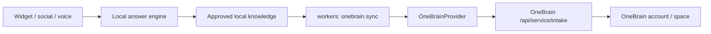

# OneBrain Integration Design

Date: 2026-07-08

## Summary

`assaddar-ai-communication` remains the customer communication runtime:
channels, conversations, contacts, handoffs, delivery state, billing, and the
operator dashboard. `onebrain` becomes the durable knowledge and memory service
through its scoped service API.

The first implementation is intentionally additive. Communication keeps its
local Project Brain and answer engine as the default runtime path, while workers
can export approved knowledge into OneBrain when service credentials are
configured. Customer-facing answers do not depend on OneBrain until latency,
privacy, and rollout controls are proven.

## Goals

- Keep the current Node communication platform and Python OneBrain service as
  separate deployable systems.
- Add a typed integration boundary that can support local and remote brain
  providers.
- Send approved, tenant-scoped knowledge to OneBrain through
  `POST /api/service/intake`.
- Avoid exposing OneBrain service keys to browsers, widgets, or channel clients.
- Preserve the current live answer path and use OneBrain in background jobs
  first.

## Non-Goals

- Do not merge the two repositories.
- Do not share database schemas or pgvector tables.
- Do not replace the local answer engine in this pass.
- Do not export raw conversation transcripts by default.
- Do not export the same unchanged local record repeatedly when OneBrain does
  not enforce `source_ref` uniqueness itself.

## Chosen Approach

Use a small provider contract in `packages/core` and a worker-owned background
sync job. The provider contract defines `intake` and `ask`; the initial concrete
provider is OneBrain service API. Workers map communication tenants and approved
knowledge chunks to OneBrain intake records.

The sync job is dormant unless `ONEBRAIN_SYNC_ENABLED=true` and both
`ONEBRAIN_API_BASE_URL` and `ONEBRAIN_SERVICE_KEY` are configured. It sends
approved local knowledge as `record_type=document`, `intent=knowledge_update`,
`source=communication`, and a stable `source_ref` based on the local tenant and
knowledge chunk IDs. A local tenant-scoped `onebrain_sync_records` table stores
the source id, source ref, content hash, external OneBrain record id, and last
status so unchanged records are skipped on later runs. The explicit enable flag
is still intentional because OneBrain currently stores `source_ref` as
provenance, not as a guaranteed uniqueness constraint.

## Tenant Mapping

- `app_id`: `communication`
- `account_id`: tenant slug by default, or `ONEBRAIN_ACCOUNT_ID` for
  single-tenant installs
- `space_id`: `ONEBRAIN_SPACE_ID` when configured; otherwise OneBrain can route
  the request for scoped service keys that allow routing
- `purpose`: `knowledge_management` for approved knowledge intake
- `source_ref`: `communication:tenant:<tenantId>:knowledge:<chunkId>`

The communication backend and workers are the only callers. Browser clients
never receive the service key.

## Data Flow

## Error Handling

- Missing OneBrain env vars skip the job cleanly.
- HTTP failures throw typed errors so BullMQ retries using the existing retry and
  dead-letter defaults.
- Sync failures are recorded locally before the job is retried.
- Already-synced records with the same content hash are skipped.
- Records with empty content are skipped before making a network call.
- The local answer path is unaffected by OneBrain outages.

## Testing

- Unit-test the OneBrain client request shape, auth header, timeout/env parsing,
  and error handling.
- Unit-test the worker sync mapping with fake tenants, knowledge chunks, and a
  fake provider.
- Run focused package tests and type checks after implementation.
