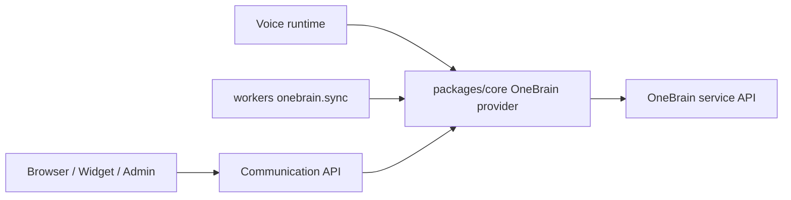

# OneBrain Canonical Service Contract Design

## Context

`assaddar-ai-communication` now treats OneBrain as the strict source of truth
for durable cross-app knowledge, memory, permissioned retrieval, service-key
scope, privacy, and audit-of-record. The communication platform still owns
channels, conversations, contacts, handoffs, billing, delivery state, and
operator workflows.

This change updates only the communication platform. The sibling `onebrain`
repository is not modified, and the communication platform must adapt to the
canonical OneBrain service contract rather than making OneBrain accept
additional env names or flexible payload shapes.

The canonical OneBrain service contract requires:

- `ONEBRAIN_API_BASE_URL` as the only OneBrain base URL env name.
- `ONEBRAIN_SERVICE_KEY` for service-key auth.
- `Authorization: Bearer <service key>` on service calls.
- Explicit `account_id`, `space_id`, `app_id`, and `purpose` in every service
  call payload that asks or writes.
- `app_id=communication` for this service.
- `purpose=customer_service_answer` for runtime answer reads.
- `purpose=customer_service_inbox` for knowledge and intake sync unless
  OneBrain changes its canonical contract.

## Recommended Approach

Enforce the canonical contract in the communication-side OneBrain adapter.

`packages/core` remains the only place that knows how to call OneBrain. API,
voice, and worker runtimes can depend on the provider abstraction, but browser,
widget, and admin client code must not call OneBrain directly or receive
OneBrain credentials.

The communication app removes app and purpose override surfaces from runtime
and sync paths. `app_id` is always the constant `communication`. Runtime asks
always use `customer_service_answer`. Knowledge/intake sync always uses
`customer_service_inbox`. `ONEBRAIN_ACCOUNT_ID` and `ONEBRAIN_SPACE_ID` remain
deployment scope inputs because the service call still must send explicit
account and space values.

## Alternatives Considered

Keep app and purpose env overrides, while documenting canonical defaults. This
is rejected because it preserves a non-canonical escape hatch and weakens
service-key scope expectations.

Let OneBrain infer missing scope from the service key. This is rejected because
the contract requires explicit `account_id`, `space_id`, `app_id`, and
`purpose` on service calls.

## Architecture

The OneBrain integration stays server-side:

`packages/core` owns:

- OneBrain service client construction.
- Canonical base URL and service key env parsing.
- Bearer auth header construction.
- Request payload scope normalization.
- Sanitized service errors.
- Provider abstraction used by API, voice, workers, and tests.

`apps/workers` owns:

- Selecting approved local knowledge for export.
- Building communication source refs and local metadata.
- Recording sync success or failure in `onebrain_sync_records`.
- Skipping unchanged already-synced records based on content and scope hash.

`apps/api` and `apps/voice` own:

- Tenant/channel runtime context.
- Trying OneBrain only when runtime answering is enabled and configured.
- Falling back to local Project Brain when OneBrain is disabled,
  unconfigured, empty, or failing.
- Recording sanitized answer trace steps.

`apps/admin` and `apps/widget` own no OneBrain calls. They can display local,
sanitized OneBrain sync status returned by the communication API.

## Data Flow

Runtime answering:

1. A channel message reaches API or voice.
2. The runtime asks the core OneBrain provider only when
   `ONEBRAIN_ANSWER_ENABLED=true` and provider credentials are configured.
3. The provider sends `POST /api/service/ask` with:
   - `account_id`
   - `space_id`
   - `app_id=communication`
   - `purpose=customer_service_answer`
   - `question`
4. If OneBrain returns a non-empty answer, the runtime returns it with a
   `onebrain_answer` trace.
5. If OneBrain is skipped or unavailable, the runtime falls back to local
   Project Brain and prepends a sanitized `onebrain_answer` trace step.

Knowledge/intake sync:

1. The worker selects approved local knowledge.
2. The worker builds a OneBrain intake request with communication metadata and
   a stable source ref.
3. The provider sends `POST /api/service/intake` with:
   - `account_id`
   - `space_id`
   - `app_id=communication`
   - `purpose=customer_service_inbox`
   - content, source, source ref, record type, intent, title, and metadata
4. The worker records success, async job handoff, skip, or failure locally.

Smoke checks:

1. `pnpm smoke:onebrain` requires `ONEBRAIN_API_BASE_URL`,
   `ONEBRAIN_SERVICE_KEY`, and `ONEBRAIN_SPACE_ID`.
2. The read-only check calls `GET /api/service/capabilities`.
3. Optional synthetic intake uses `customer_service_inbox`.
4. Output must not print service keys.

## Error Handling

OneBrain failures must be traceable without leaking secrets.

Runtime fallback trace details are limited to stable non-secret labels:

- `disabled`
- `not_configured`
- `empty_answer`
- `error`

Logs can include sanitized error messages and status codes, but not service
keys, auth headers, full request payload secrets, or user-private retrieved
content. Worker sync failures continue to write local failure records so
operators can inspect local sync state even when OneBrain is unavailable.

## Tests

Update or add tests that prove:

- `createOneBrainProvider` only uses `ONEBRAIN_API_BASE_URL` and
  `ONEBRAIN_SERVICE_KEY` for service connectivity.
- No legacy or alternate OneBrain base URL env name is accepted.
- Service calls send `Authorization: Bearer <service key>`.
- Ask requests include explicit `account_id`, `space_id`,
  `app_id=communication`, and `purpose=customer_service_answer`.
- Intake requests include explicit `account_id`, `space_id`,
  `app_id=communication`, and `purpose=customer_service_inbox`.
- App and purpose env overrides do not change the canonical values.
- Runtime fallback uses local Project Brain and records sanitized traces when
  OneBrain is disabled, unconfigured, empty, or failing.
- Worker sync content hashes include scope fields so purpose or scope changes
  trigger resync.
- Admin/widget/browser code has no direct OneBrain service calls or exposed
  service credentials.
- Smoke checks validate the canonical app and purpose values.

## Documentation

Update `.env.example`, deployment notes, README smoke notes, and smoke-check
output expectations so they show only the canonical contract:

- `ONEBRAIN_API_BASE_URL`
- `ONEBRAIN_SERVICE_KEY`
- `ONEBRAIN_ACCOUNT_ID`
- `ONEBRAIN_SPACE_ID`
- `ONEBRAIN_ANSWER_ENABLED`
- `ONEBRAIN_SYNC_ENABLED`
- `ONEBRAIN_SYNC_INTERVAL_MS`
- `ONEBRAIN_KNOWLEDGE_EXPORT_LIMIT`
- `ONEBRAIN_SMOKE_INTAKE`

The docs should name the fixed values directly instead of presenting app or
purpose override env vars:

- `app_id=communication`
- runtime purpose `customer_service_answer`
- sync purpose `customer_service_inbox`

## Acceptance Criteria

- OneBrain is unchanged.
- Communication-side OneBrain service calls match the canonical contract.
- Browser, widget, and admin client code never call OneBrain directly.
- Runtime fallback to local Project Brain remains available and traceable.
- Tests cover env names, auth, scope fields, app id, purposes, direct-call
  boundaries, and fallback.
- Docs and env examples show only the canonical communication contract.
